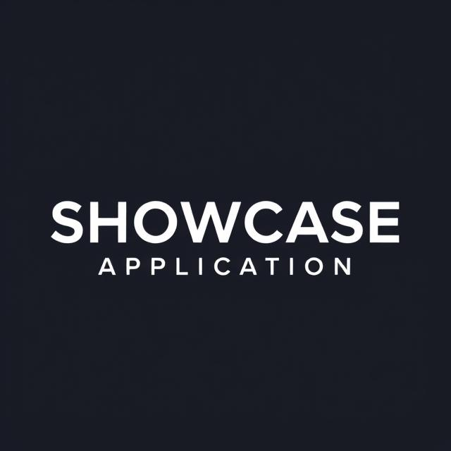

# SHOWCASE OTTO APPLICATIOM

<a href="https://github.com/just-rene/showcase-application/blob/main/follow-coin-compute/src/test/java/com/follow_coin/follow_coin_compute/events/unit_tests/EventBusInTest.java" rel="nofollow">Unit Tests</a>  
<a href="https://github.com/just-rene/showcase-application/blob/main/follow-coin-compute/src/test/java/com/follow_coin/follow_coin_compute/events/integragtions_tests/EventBusInIntegrationsTest.java" rel="nofollow">Integration Tests</a>  
<a href="https://github.com/just-rene/showcase-application/blob/main/.github/workflows/maven-publish.yml" rel="nofollow">Github Actions</a>  
<a href="https://github.com/just-rene/cdk-docker-nginx-deployment" rel="nofollow"> AWS Cloud Development Kit (CDK) </a>

